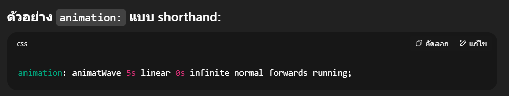

# What I learn new thing
## note
* ตัวแปรสี
```css
/* Color Variables */
:root {
    --primary-black: #000000;
    --primary-white: #ffffff;
    --primary-blue: #3573b7;
    --black-blue-gradient: linear-gradient(135deg, #000000 0%, #3573b7 100%);
    --blue-pink-gradient: linear-gradient(135deg, #3573b7, #fecfef);
    --LINE: #06c755; /*สีของ LINE*/
}
```
* อะไรที่ซ้ำๆ เอามาทำเป็น class
* ```min-height: 100vh;``` ใส่ min จะได้ไม่ล้น

## ไอเดียการทำ responsive
```@media screen and (max-width: 768px)``` ให้คิดว่าถ้าหน้าจอเหลือแค่นี้จะจัดหน้ายังไง
1. ลดขนาด font img
2. ```flex-direction: column;``` เพื่อให้เนื้อหาลงมาต่อข้างล่างได้
3. เปลี่ยนการจัดเรียงของ

## Animation
* ใช้เป็น script ของคนอื่น 
```html
<!---animation--->
    <link href="https://unpkg.com/aos@2.3.1/dist/aos.css" rel="stylesheet">


<script src="https://unpkg.com/aos@2.3.1/dist/aos.js"></script>
<script>
  AOS.init();
</script>
```
อยากใช้ที่ไหนก็วางไปเหมือนเป็น attribute ตัวนึง เช่น
```html
<section data-aos="fade-up">
```
-------------------------------------------
* ลองใช้ @keyframe ทำ animation footer แต่รู้สึกว่าเอามาใส่ในเว็บนี้แล้วดูขัดๆ เลยใช้แบบบน

วิธีทำเต็มๆ [youtube](https://www.youtube.com/watch?v=UpkEANWC2Ms&t=548s)
```html
<footer>
        <div class="waves">
            <div class="wave" id="wave1"></div>
            <div class="wave" id="wave2"></div>
            <div class="wave" id="wave3"></div>
            <div class="wave" id="wave4"></div>
        </div>
        <p>Copyright &copy;2025 Designed by
                <span><a href="#header">Mister S</a></span>
            </p>
    </footer>
```
* ไอเดียการเขียน animation
1. เขียน animation เตรียมไว้
**ตัวอย่าง**
```css
@keyframes animatWave{ /* animatWave = animate name*/
    0%{ /*0% คือตอนเริ่มให้ทำไร*/
        background-position-x: 1000px; /*เลื่อนขวา*/
    }
    100%{ /*100% คือตอนเสร็จให้ทำไร*/
        background-position-x: 0px; /*กลับมาที่เดิม*/
    }
}
```

2. เราจะ animation ใคร ก็ใช้คำสั่ง ```animation:```
**ตัวอย่าง**
```css
footer .wave#wave1{
    z-index: 1000;
    opacity: 1;
    bottom: 0;
    animation: animatWave 4s linear infinite; /*ชื่อanimate เวลา รูปแบบ วิธีการแสดงผลหลังanimate*/
}
```

| พารามิเตอร์               | ค่า          |
| ------------------------- | ------------ |
| animation-name            | `animatWave` |
| animation-duration        | `5s`         |
| animation-timing-function | `linear`     |
| animation-delay           | `0s`         |
| animation-iteration-count | `infinite`   |
| animation-direction       | `normal`     |
| animation-fill-mode       | `forwards`   |
| animation-play-state      | `running`    |
----------------------------------------------


**ตัวอย่างFooter**
```css
.footerBootom{
    padding: 10px;
    text-align: center;
}
.footerBootom a{
    opacity: 0.7;
    color: var(--primary-white);
    text-transform: uppercase;
    letter-spacing: 1px;
    margin: 0px 5px;
    transition: tranform .5s ease;
}
.footerBootom a:hover{
    /*ทำให้ตัวอักษรไล่สี*/
    background: var(--blue-pink-gradient);

    background-clip: text;
    -webkit-background-clip: text;
    -webkit-text-fill-color: transparent;
}

footer{
    position: relative;
    width: 100%;
    background: #3586ff;
    min-height: 100px;
    padding: 20px 50px;
    justify-content: center;
    align-items: center;
}

footer .wave{
    position: absolute;
    top: -50px; /*เลื่อนให้ wave ขึ้นไปอยู่บยกล่อง footer*/
    left: 0;
    width: 100%;
    height: 50px; /*ต้อง= top*/
    background:  url(/img/wave.png);
    background-size: 1000px 50px; /*1000px is width, 50px is heightต้อง = height = top*/
}

footer .wave#wave1{
    z-index: 1000;
    opacity: 1;
    bottom: 0;
    animation: animatWave 4s linear infinite;
}
footer .wave#wave2{
    z-index: 999;
    opacity: 0.5;
    bottom: 10px;
    animation: animatWave_2 4s linear infinite;
}
footer .wave#wave3{
    z-index: 1000;
    opacity: 0.2;
    bottom: 15px;
    animation: animatWave 3s linear infinite;
}
footer .wave#wave4{
    z-index: 999;
    opacity: 0.7;
    bottom: 20px;
    animation: animatWave 3s linear infinite;
}

@keyframes animatWave{
    0%{
        background-position-x: 1000px;
    }
    100%{
        background-position-x: 0px;
    }
}
@keyframes animatWave_2{
    0%{
        background-position-x: 0px;
    }
    100%{
        background-position-x: 1000px;
    }
}
```